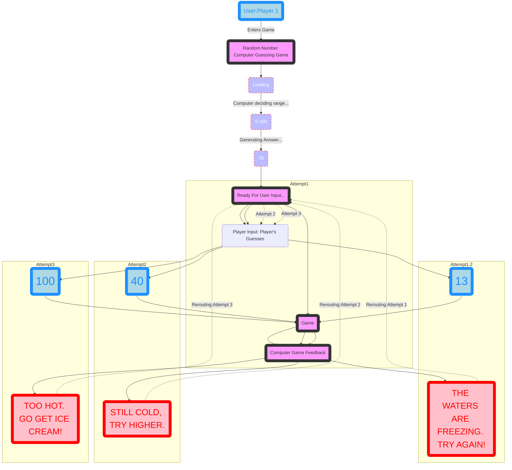

```mermaid 
flowchart TB
    id5(User:Player 1) -- Enters Game -->
    id1(Random Number Computer Guessing Game)-->id2(Loading) -- Computer deciding range... -->id3(0-100) -- Generating Answer... -->id4(78)-->id6(Ready For User Input...)
  subgraph Attempt1
    id6-->id11(Game)-->id7(Computer Game Feedback)
    id6-->id8(Player Input: Player's Guesses)
  end
  subgraph Attempt1.2
    id7-->id9(THE WATERS ARE FREEZING. TRY AGAIN!)
    id6-->id8-->id10(13) -->id11
    id9 -. Rerouting:Attempt 1 .->id6
  end
  subgraph Attempt2
    id6 -. Attempt 2 .->id8-->id13(40)-->id11-->id7-->id14(STILL COLD, TRY HIGHER.) -. Rerouting:Attempt 2 .->id6
  end
  subgraph Attempt3
    id6 -. Attempt 3 .->id8-->id15(100)-->id11-->id7-->id16(TOO HOT. GO GET ICE CREAM!) -. Rerouting:Attempt 3 .->id6
  end
    style id1 fill:#f9f,stroke:#333,stroke-width:10px
    style id11 fill:#f9f,stroke:#333,stroke-width:10px
    style id7 fill:#f9f,stroke:#333,stroke-width:10px
    style id6 fill:#f9f,stroke:#333,stroke-width:10px
    style id2 fill:#bbf,stroke:#f66,stroke-width:2px,color:#fff,stroke-dasharray: 5 5
    style id3 fill:#bbf,stroke:#f66,stroke-width:2px,color:#fff,stroke-dasharray: 5 5
    style id4 fill:#bbf,stroke:#f66,stroke-width:2px,color:#fff,stroke-dasharray: 5 5
    style id5 fill:#ADD8E6,stroke:#1E90FF,stroke-width:10px,font-size:20px,color:#1E90FF
    style id9 fill:#FFC0CB,stroke:#FF0000,stroke-width:10px,font-size:30px,color:#FF0000

    style id16 fill:#FFC0CB,stroke:#FF0000,stroke-width:10px,font-size:30px,color:#FF0000
    style id14 fill:#FFC0CB,stroke:#FF0000,stroke-width:10px,font-size:30px,color:#FF0000
    style id10 fill:#ADD8E6,stroke:#1E90FF,stroke-width:10px,font-size:40px,color:#1E90FF

    style id13 fill:#ADD8E6,stroke:#1E90FF,stroke-width:10px,font-size:40px,color:#1E90FF
    style id15 fill:#ADD8E6,stroke:#1E90FF,stroke-width:10px,font-size:40px,color:#1E90FF
   

``` 
