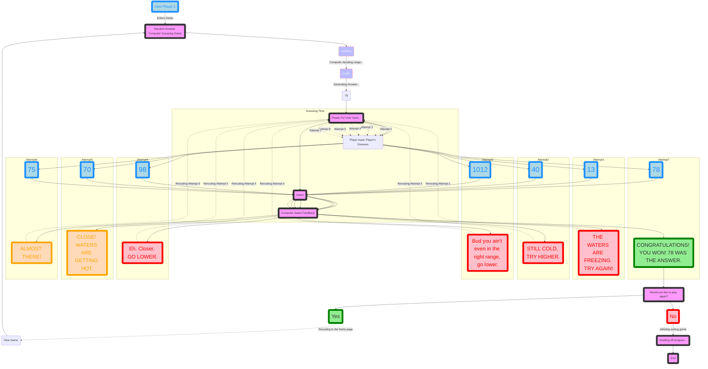

# Implementing a Random Guessing Game:

## Flow chart description:
1. (Step 1)A user enters the game. In this example we will be calling the user: "Player 1".
    * The user and their actions will be identify in **blue**.
    * The game and its feed will be identify in **pink and black**.
2. (Step 2)The "Random Number Computer Guessing Game" will direct the user to the loading screen.
    * Loading: **Red dotted lines, white text, and purple background**, this also represents displayed text. 
    * This is where the computer takes time to decide the range where the answer will fall in.
    * In this example the range **0-100** has been decided on, and displayed to the user.
    * After the range has been decided on, the game will randomly generate a number.
          * In this event the number **78** has been chosen.
3. (Step 3)Now the game is "Ready For User Input...".
    * This is where the game waits for the user to input a number.
    * This falls under the "Guessing Time" subgraph, and is also where you get redirected every time you get it wrong.
    * Quitting is not a option.
4. (Step 4)The player inputs their guess, as shown by the: **singlar grey box, leading to the blue box**
    * In this example, the first attempt being "Attempt1", input:#13.
        * This is also where the attempts get separated and fed back to the "Guessing time" subgraph.
5. (Step 5)The guess #13 gets inserted into the "Game", which then goes to the "Computer Game Feedback".
    * The "Computer Game Feedback" sends back a response to the incorrect answer, "THE WATERS ARE FREEZING. TRY AGAIN!".
        * Both the player input #13 and the "Computer Game Feedback":"THE WATERS ARE FREEZING. TRY AGAIN!", will be separated in subgraphs from the "Guessing Time" identified by # of attempts.
        * In this case, it will be subgraph "Attempt1".
        * "THE WATERS ARE FREEZING. TRY AGAIN!" informs "Player 1" that their answer is incorrect.
        * "FREEZING", allowing them know they are way below the correct input.
6. (Step 6)This then redirects them through the **dotted line** on the flow chart back to "Ready For User Input..."
    * As shown by the "Rerouting:Attempt 1".
    * Then through another **dotted line** now represented as "Attempt 2" to "Player Input: Player's Guesses".
7. (Step 7)This is where the process repeats itself untill the user gets the answer correct.
    * From (Step 3)-(6).
    * As you can see in this example, it took "Player 1" 7 tries till they got the answer right.
    * All the different attempts will have different subgraphs representing them.
    * Each "Computer Game Feedback" response will be customized by the distance from the answer, whether it's above or below, and far or close.
        * It is also customized by the colors: red, orange, and green. Representing: wrong, close, and right.
8. (Step 8)Once you've guessed the correct answer, you will be met with a green boxed text, in this case "CONGRATULATIONS! YOU WON! 78 WAS THE ANSWER.".
9. (Step 9)After winning, the game will ask you, "Would you like to play again?"
   * Presenting 2 options, "Yes" or "No"?
        * Pick "Yes", you will be rerouted to the home page, to a "New Game", and right back to the "Random Number Computer Guessing Game". Where you first started the game, the whole process will repeat, and infinitely if you choose.
        * Pick "No", you will be "initiating exiting game", leading to "Shutting off program...", leading to the end.
10. (Step 10)After the end, the game will shut down. If you'd like to play again, you'll have to re-enter the game.

   
